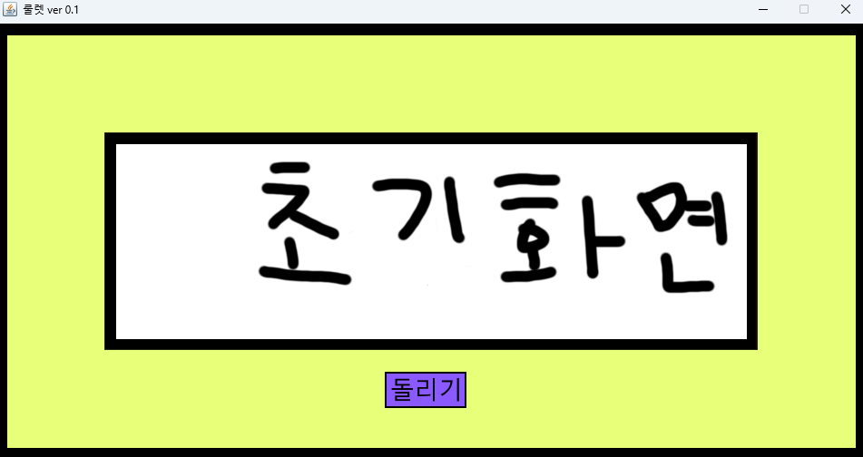
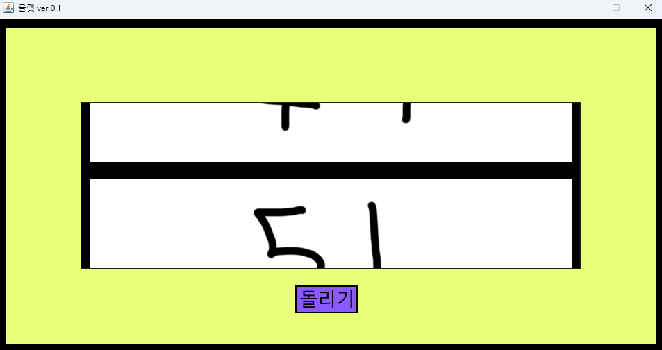

# Roulette
중복되지 않는 결과를 반환하는 룰렛
## 데모

## 주요 기능
 - 돌리기 버튼을 눌러 룰렛 요소 여러 개 중 하나를 중복되지 않게 뽑기
 - 배경, 룰렛 버튼, 룰렛 요소 이미지를 data에 넣어 커스터마이징 가능

## 폴더 구조
### ./
 * Roulette.jar - 소스 코드 jar 파일  
 * 설명서 같은거.txt - 간단한 설명 텍스트 파일  
 * 나를 실행해.cmd - jar 파일을 실행하는 명령어 실행기  
### ./data  
 - Background.png - 배경 이미지 (960x480)
 - Button.png - 돌리기 버튼 (90x40)
 - init_result.png - 초기 화면 (720x240)
 - result.wav - 결과가 나왔을 때 재생
 - roll.wav - 룰렛이 진행중일 때 재생
 - rolling.png - 룰렛이 진행중일 때 images 에 있는 모든 이미지를 합친 연출용 이미지
 - ./images - 룰렛에 사용할 이미지를 보관하는 폴더. 모든 이미지의 크기는 720x240 이어야 함